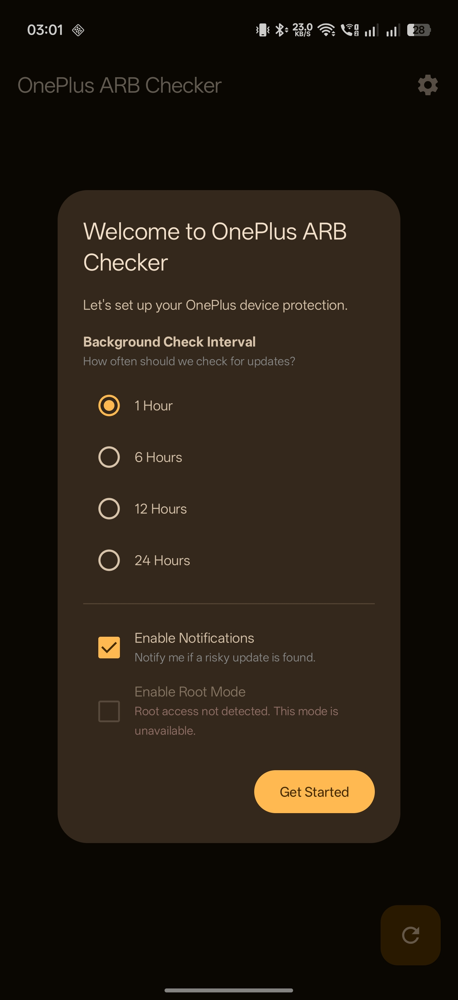
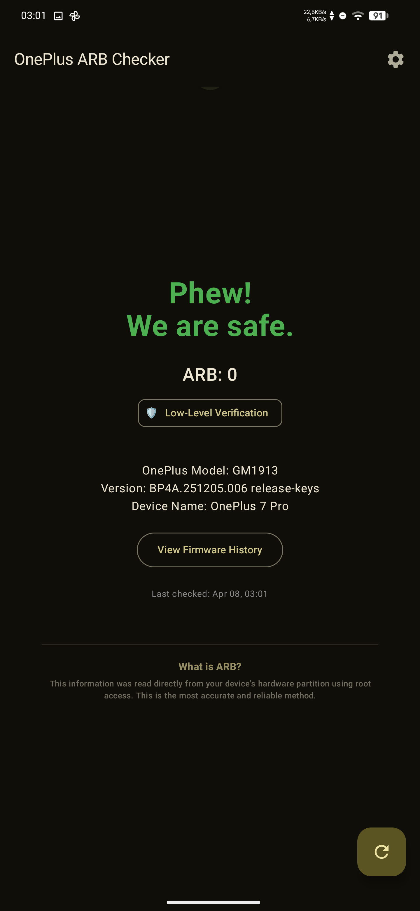
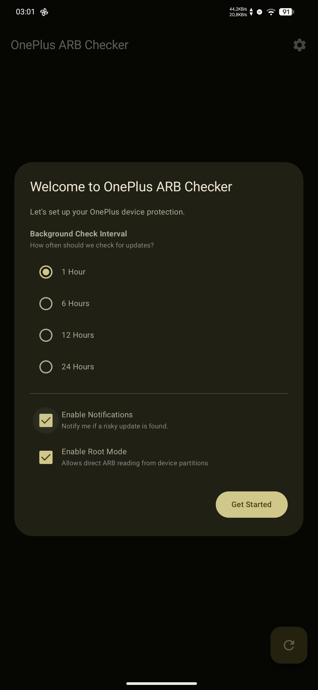

# OnePlus ARB Checker 📱🛡️

**OnePlus ARB Checker** is a professional Android utility designed to help OnePlus users monitor and verify their device's **Anti-Rollback (ARB)** status. Built with **Jetpack Compose** and **Material 3**, it provides both software-based analysis and low-level hardware verification to prevent accidental bricks during firmware operations.

This project is a mobile companion to the [OnePlus-antirollchecker](https://github.com/Bartixxx32/OnePlus-antirollchecker) database.

---

## ✨ Features

- **🛡️ Dual Verification Methods:**
    - **Software Version Analysis:** Cross-references your firmware build with a community-maintained database (oparb.pages.dev).
    - **Low-Level Verification (Root):** Direct hardware-level extraction of the ARB index from device partitions (`xbl`/`xbl_config`) for 100% accuracy.
- **🔍 Real-time ARB Check:** Instantly see if your current firmware is FUSED or SAFE.
- **📅 Background Monitoring:** Reliable background tasks (WorkManager) check for new firmware releases and notify you if a risky update (increased ARB) is detected.
- **📚 Firmware History:** Browse a comprehensive list of firmware versions for your specific OnePlus model.
- **🎨 Professional UI:** Modern Material 3 interface with dynamic themes, haptic feedback, and a refined "Welcome Wizard" for easy setup.
- **🌍 Regional Awareness:** Automatically identifies firmware regions and lifecycle status (Current vs. Archived).

---

## 🛠️ How It Works

The app employs two layers of protection:
1. **Database Layer:** Identifies your device model and build ID, fetching verified ARB data from the cloud.
2. **Hardware Layer (Optional):** If Root access is available, the app can perform a low-level dump of the bootloader config to read the physical ARB fuse status directly from the hardware.

If a future update is known to increase the ARB index, the app proactively warns you before you install it.

---

## 📸 Screenshots

| Welcome Wizard | Status: Safe | Status: Fused | Firmware History |
| :---: | :---: | :---: | :---: |
|  |  |  |  |

---

## 🚀 Installation & Build

### Prerequisites
- Android 8.0+ (Oreo) device
- Root access (optional, for Low-Level Verification)
- JDK 21+ (for building)

### Build from source
1. Clone the repository:
   ```bash
   git clone https://github.com/Bartixxx32/oparbcheckapp.git
   ```
2. Open in Android Studio Ladybug+.
3. Build and run the `app` module.

---

## 🏗️ Built With

- **Jetpack Compose** - Declarative UI toolkit.
- **Retrofit & OkHttp** - API communication.
- **WorkManager** - Background synchronization.
- **DataStore** - Modern, type-safe data storage.
- **Material 3** - Modern design system.

---

## 🤝 Contributing

Contributions are welcome! If you find a bug or have a feature suggestion, please open an issue. To contribute data, please visit the [main database repository](https://github.com/Bartixxx32/OnePlus-antirollchecker).

---

## 📜 License

This project is licensed under the **MIT License**. See the [LICENSE](LICENSE) file for details.

---

## ⚠️ Disclaimer

*This application is an independent tool and is not affiliated with OnePlus or OPPO. Use it at your own risk. While low-level verification is highly accurate, always double-check before performing critical system operations.*

Developed with ❤️ by [Bartixxx32](https://github.com/Bartixxx32)
