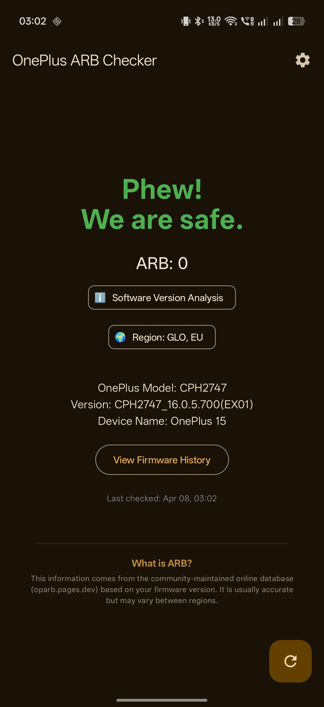

# OnePlus ARB Checker 📱🛡️

**OnePlus ARB Checker** is a powerful and user-friendly Android application designed to help OnePlus users monitor their device's **Anti-Rollback (ARB)** status. Built with modern technologies like **Jetpack Compose** and **Material 3**, it provides real-time information to prevent accidental bricks during firmware downgrades.

This project is a mobile companion to the [OnePlus-antirollchecker](https://github.com/Bartixxx32/OnePlus-antirollchecker) database.

---

## ✨ Features

- **🔍 Real-time ARB Check:** Instantly see if your current firmware has ARB enabled (FUSED) or if you are still in the safe zone.
- **📅 Background Monitoring:** Automatically checks for new firmware releases in the background and notifies you if a risky update (increased ARB) is detected.
- **📚 Firmware History:** Browse a comprehensive list of firmware versions for your specific OnePlus model and see which ones introduced ARB.
- **🎨 Material 3 Design:** A beautiful, modern interface with support for Edge-to-Edge displays and dynamic system themes.
- **📳 Haptic Feedback:** Intuitive vibrations provide tactile confirmation for status checks and results.
- **🌍 Regional Awareness:** Identifies your firmware's region and status (Current vs. Archived).
- **🤝 Easy Sharing:** Quickly share your ARB status with the community or support groups.

---

## 🛠️ How It Works

The app identifies your device model and current firmware build from the system properties. It then fetches the latest verified ARB database to compare your version against known values. 

If a future update for your device is known to increase the ARB index, the app will proactively warn you to exercise caution before installing it.

---

## 📸 Screenshots

| Welcome Screen | Status: Safe | Status: Fused | Firmware History |
| :---: | :---: | :---: | :---: |
|  | (Screenshot Placeholder) | (Screenshot Placeholder) | (Screenshot Placeholder) |

*(Screenshots are managed via Fastlane for Play Store deployment)*

---

## 🚀 Installation & Build

### Prerequisites
- Android Studio Ladybug (or newer)
- JDK 17+
- Android 8.0+ (Oreo) device

### Build from source
1. Clone the repository:
   ```bash
   git clone https://github.com/Bartixxx32/OnePlus-ARB-Check-App.git
   ```
2. Open the project in Android Studio.
3. Sync Gradle and run the `app` module on your device.

---

## 🏗️ Built With

- **[Jetpack Compose](https://developer.android.com/jetpack/compose)** - Modern toolkit for building native UI.
- **[Retrofit](https://square.github.io/retrofit/)** - Type-safe HTTP client for API communication.
- **[WorkManager](https://developer.android.com/topic/libraries/architecture/workmanager)** - For reliable background firmware checks.
- **[Material 3](https://m3.material.io/)** - The latest evolution of Material Design.
- **[Kotlin Coroutines](https://kotlinlang.org/docs/coroutines-overview.html)** - Asynchronous programming.

---

## 🤝 Contributing

Contributions are welcome! If you find a bug or have a feature suggestion, please open an issue or submit a pull request. To help expand the database, please contribute to the main [database repository](https://github.com/Bartixxx32/OnePlus-antirollchecker).

---

## 📜 License

This project is licensed under the **MIT License**. See the [LICENSE](LICENSE) file for details.

---

## ⚠️ Disclaimer

*This application is an independent tool and is not affiliated with OnePlus or OPPO. While we strive for accuracy, firmware data is community-sourced. Always double-check before performing critical system operations.*

Developed with ❤️ by [Bartixxx32](https://github.com/Bartixxx32)
